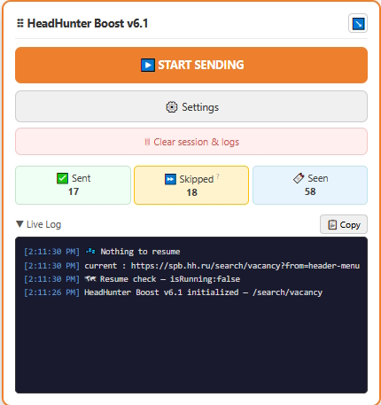
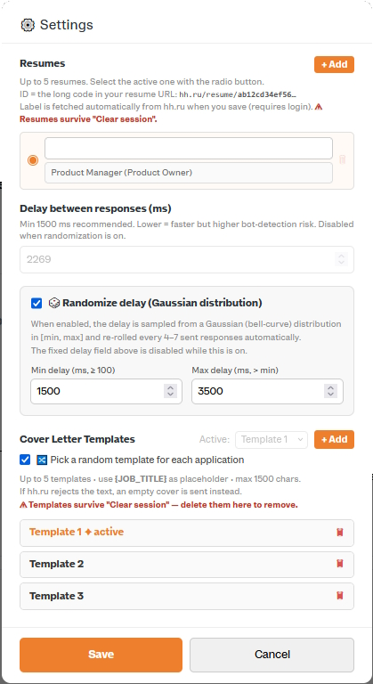

# HeadHunter Boost — автоматические отклики на hh.ru

**Tampermonkey-скрипт для автоматизации откликов на hh.ru** — сам нажимает «Откликнуться», подставляет сопроводительное письмо и отправляет отклик. Без Node.js, без регистрации, бесплатно.

> **Automatic job application bot for hh.ru** — Tampermonkey userscript that auto-applies to vacancies with a custom cover letter template. Free, no setup required.

[](https://github.com/mklishin/headhunter-boost/releases)
[](LICENSE)
[](https://www.tampermonkey.net/)
[](#)

---

## Содержание

- [Что это такое](#что-это-такое)
- [Возможности](#возможности)
- [Установка](#установка)
- [Как пользоваться](#как-пользоваться)
- [Настройки](#настройки)
- [Панель управления](#панель-управления)
- [Сброс сессии](#сброс-сессии)
- [FAQ](#faq)
- [Технические детали](#технические-детали)
- [История изменений](#история-изменений)

---

## Что это такое

**HeadHunter Boost** — бесплатный userscript для браузера, который автоматизирует массовую отправку откликов на hh.ru. Устанавливается через Tampermonkey за 2 клика, работает прямо на странице поиска вакансий.



Скрипт перебирает все кнопки «Откликнуться» на странице, подставляет ваш шаблон сопроводительного письма (с автозаменой `{JOB_TITLE}` на название вакансии) и отправляет отклик. Вакансии с тестами или дополнительными вопросами пропускаются и сохраняются в отдельный список со ссылками.

## Возможности

### Основные функции

| Функция | Описание |
|---|---|
| Автоотклик | Автоматический перебор всех кнопок «Откликнуться» на текущей странице |
| Шаблоны писем | До 5 шаблонов сопроводительного письма, переменная `{JOB_TITLE}` заменяется на название вакансии |
| Случайный шаблон | Случайный выбор шаблона при каждом отклике (требует ≥ 2 шаблонов) |
| Пропуск сложных | Вакансии с тестами / дополнительными вопросами пропускаются и сохраняются со ссылками |
| Лимит hh.ru | Автоматическая остановка при достижении 200 откликов в сутки с уведомлением |
| SPA-навигация | Возврат на страницу поиска через `history.back()` без перезагрузки страницы |

### Удобство использования

| Функция | Описание |
|---|---|
| Перетаскиваемая панель | Интерфейс можно переместить в любое место экрана |
| Журнал событий | Только события, связанные со скриптом — без лишнего шума из консоли |
| Счётчики в реальном времени | Отправлено / Пропущено / Обработано |
| Рандомизация задержки | Гауссово распределение в диапазоне [Мин, Макс], пересчитывается каждые 4–7 откликов |
| Сохранение состояния | Настройки и шаблоны сохраняются между перезагрузками страницы |

---

## Установка

### Шаг 1 — Установите Tampermonkey

Подходит любой совместимый менеджер скриптов: Tampermonkey, Violentmonkey, Greasemonkey.

| Браузер | Ссылка |
|---|---|
| Chrome | [Chrome Web Store](https://chrome.google.com/webstore/detail/tampermonkey/dhdgffkkebhmkfjojejmpbldmpobfkfo) |
| Firefox | [Firefox Add-ons](https://addons.mozilla.org/firefox/addon/tampermonkey/) |
| Edge | [Edge Add-ons](https://microsoftedge.microsoft.com/addons/detail/tampermonkey/iikmkjmpaadaobahmlepeloendndfphd) |
| Яндекс Браузер | [Chrome Web Store](https://chrome.google.com/webstore/detail/tampermonkey/dhdgffkkebhmkfjojejmpbldmpobfkfo) |
| Opera | [Opera Addons](https://addons.opera.com/extensions/details/tampermonkey-beta/) |

### Шаг 2 — Установите скрипт

**Способ А — одним кликом** (Tampermonkey автоматически предложит установку):

```
https://raw.githubusercontent.com/mklishin/headhunter-boost/main/headhunter-boost.user.js
```
**Способ Б — вручную:**

1. Откройте Tampermonkey → **Создать новый скрипт**
2. Удалите весь текст в редакторе
3. Вставьте содержимое файла [`headhunter-boost.user.js`](headhunter-boost.user.js)
4. Нажмите **Ctrl+S**

---

## Как пользоваться

### 1. Откройте поиск вакансий

Перейдите на страницу поиска с выбранным резюме. Проще всего: открыть hh.ru → выбрать резюме в шапке → «Найти вакансии». URL будет иметь вид:

```
https://hh.ru/search/vacancy?resume=ВАШ_ID&from=resumelist
```
> ⚠️ Укажите страну поиска через фильтр. Модальное окно при отклике на вакансию из другой страны нарушает работу скрипта.

### 2. Найдите панель управления

В правом нижнем углу появится панель **HeadHunter Boost**. Её можно перетащить в любое место экрана.



### 3. Введите Resume ID

Нажмите **⚙️ Настройки**. В поле «Resume ID» вставьте ваш ID резюме — длинный буквенно-цифровой код из URL:

```
https://hh.ru/resume/ab12cd34ef56gh78ij90kl12mn34op56
                     ^^^^^^^^^^^^^^^^^^^^^^^^^^^^^^^^
                     вот этот код
```

### 4. Запустите

Нажмите **▶️ НАЧАТЬ ОТПРАВКУ**. Скрипт автоматически пройдёт по всем вакансиям на текущей странице.

> Лимит hh.ru — **200 откликов в сутки** (проверено май 2025). При достижении лимита скрипт остановится и покажет уведомление.

---

## Настройки

### Основные параметры

| Параметр | Описание |
|---|---|
| **Resume ID** | ID резюме из URL (`hh.ru/resume/<ВАШ_ID>`) |
| **Задержка (мс)** | Пауза между откликами. Минимум 1500 мс. Отключается при включении рандомизации |

### Рандомизация задержки (рекомендуется)

Включается отдельным переключателем. При включении фиксированная задержка заменяется случайной по гауссову распределению в диапазоне [Мин, Макс]. Задержка автоматически пересчитывается каждые 4–7 откликов.

| Параметр | Описание |
|---|---|
| **Мин. задержка** | Нижняя граница диапазона. Минимум 100 мс |
| **Макс. задержка** | Верхняя граница диапазона. Должна быть больше минимальной |

### Шаблоны сопроводительного письма

- До **5 шаблонов**
- Используйте `{JOB_TITLE}` — автоматически подставится название вакансии
- До **1500 символов** в каждом шаблоне
- Можно включить **случайный выбор шаблона** (требует ≥ 2 шаблонов)
- Если hh.ru отклоняет текст письма — отклик отправляется без письма, чтобы не потерять вакансию

> ⚠️ Шаблоны **не сбрасываются** кнопкой «Сбросить сессию». Для удаления откройте Настройки и удалите вручную.

---

## Панель управления

```
┌─────────────────────────────────────┐
│ ⠿ HeadHunter Boost v6.1          ↘️ │  ← перетаскивать за заголовок; ↘️ — вернуть в угол
├─────────────────────────────────────┤
│ [  ▶️ НАЧАТЬ ОТПРАВКУ            ]  │
│ [  ⚙️ Настройки                  ]  │
│ [  🗑 Сбросить сессию и журнал   ]  │
├───────────────┬──────────┬──────────┤
│  ✅ Отправлено │ ⏩ Пропущено │ 🔖 Обработано │
│      12       │     3    │    15    │
├─────────────────────────────────────┤
│ ▼ Журнал                  📋 Копировать │
│ [10:32:15] ✅ Отклик отправлен      │
│ [10:32:11] 👆 id:133135055 "Python" │
│ [10:32:08] 🔍 Кнопок: 8, новых: 5  │
└─────────────────────────────────────┘
```

**Счётчик ⏩ Пропущено** — кликабелен. Откройте список пропущенных вакансий с заголовком, ссылкой и временем.

---

## Сброс сессии
Кнопка **🗑 Сбросить сессию и журнал** запрашивает подтверждение и сбрасывает:

| Сбрасывается | Не сбрасывается |
|---|---|
| Счётчик отправленных | Resume ID |
| Счётчик и список пропущенных | Задержка |
| Список обработанных ID вакансий | Шаблоны писем |
| Журнал событий | Позиция панели |
---

## FAQ
**Скрипт не находит кнопки «Откликнуться»**

hh.ru регулярно обновляет разметку страницы. Убедитесь, что вы на странице результатов поиска — не на странице отдельной вакансии. Сделайте жёсткую перезагрузку: **Ctrl+Shift+R** (Windows/Linux) или **Command+Shift+R** (macOS).

**Скрипт завис после перехода на страницу вакансии**

Редкий случай, когда `history.back()` не сработал. Нажмите кнопку «Назад» в браузере вручную — скрипт возобновится автоматически.

**Не вижу панель управления**

Обновите страницу. Убедитесь, что скрипт активен в Tampermonkey (иконка расширения в панели браузера → скрипт должен быть включён).

**Отклик отправляется без сопроводительного письма**

hh.ru проверяет текст письма регулярным выражением. Если шаблон не проходит проверку, скрипт намеренно очищает поле и отправляет отклик без письма — это лучше, чем не отправить совсем.

**Можно ли запускать скрипт в нескольких вкладках одновременно?**

Нет. Несколько вкладок конкурируют за GM-хранилище и ломают состояние друг друга. Запускайте только в одной вкладке и держите её в фокусе.

---
## Технические детали

<details>
<summary>Раскрыть</summary>

### Почему сложные вакансии не открываются в фоновой вкладке

Все вкладки `*.hh.ru` запускают этот скрипт. Если открыть сложную вакансию в фоне, её экземпляр скрипта вызовет `GM_setValue("isRunning", false)` и сломает основной цикл. Поэтому сложные вакансии только логируются — без открытия.

### Как работает SPA-навигация

hh.ru — React SPA. Переход на страницу вакансии обычно происходит через `history.pushState`. После обнаружения скрипт вызывает `history.back()` — страница возвращается без перезагрузки и без потери JS-контекста. Тайм-аут 2 с защищает от случаев, когда hh.ru выполняет жёсткую навигацию.

### Откуда берётся ID вакансии

Атрибута `data-vacancy-id` на карточках hh.ru нет (проверено май 2025). ID извлекается из `href` ссылки заголовка вакансии или из параметра `vacancyId` в URL переадресации.

</details>
